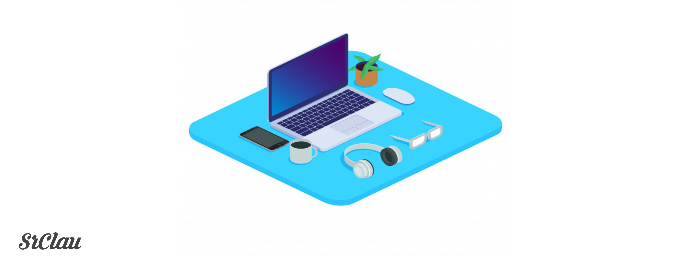

<h1 align="center">Hi👋, I'm Claudio</h1>
 

<h2 align="center">Web Developer & Game Developer</h2>

- Test Text
 
- Test Text
 
<i>
- Test Text
</i>

<h3 align="left">Social Networks</h3>

<!-- - 💤 Always Tired

- 😩 I’m currently working on **NoobyMC**
- 💯 Fun fact: I always look for my own **solutions** / **definitions**

• I Dedicate Myself To

- PocketMine-MP (Software Minecraft Bedrock Edition)
- VideoGames-->

# My Jobs

- [HCF](https://github.com/SrClau/HCF)
- [SkyWars](https://github.com/SrClau/NOPOR)
- [LanguageAPI](https://github.com/SrClau/LanguageAPI)
- [MinePE](https://github.com/SrClau/MinePECPP)
- [SilentsShot](https://github.com/TEST/SilentsShotGame)
